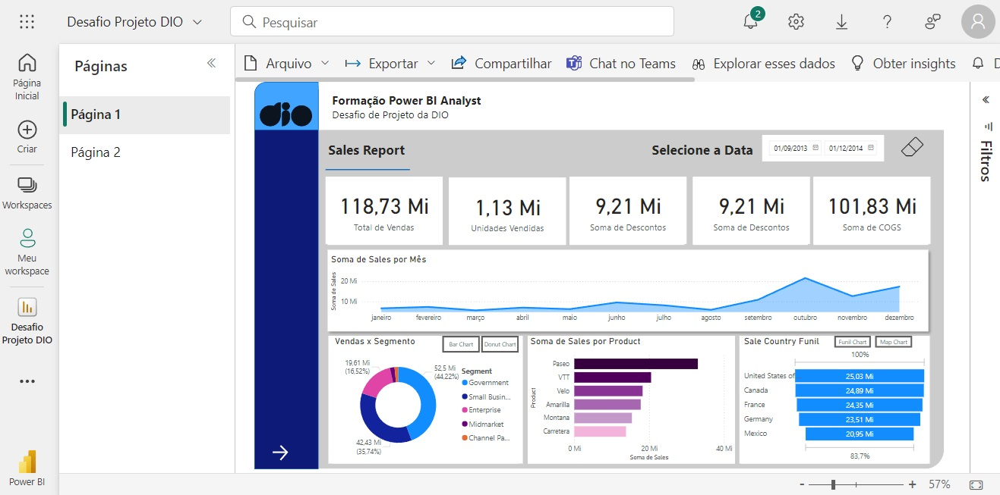

# Criação de Um relatório Gerencial de Vendas com Power BI

Neste desafio foi solicitado que utilizasse os dados financeiros fornecidos pelo próprio Power BI e fízesse um relatório de vendas e de lucros. Em seguida realizar a publicação do mesmo.

